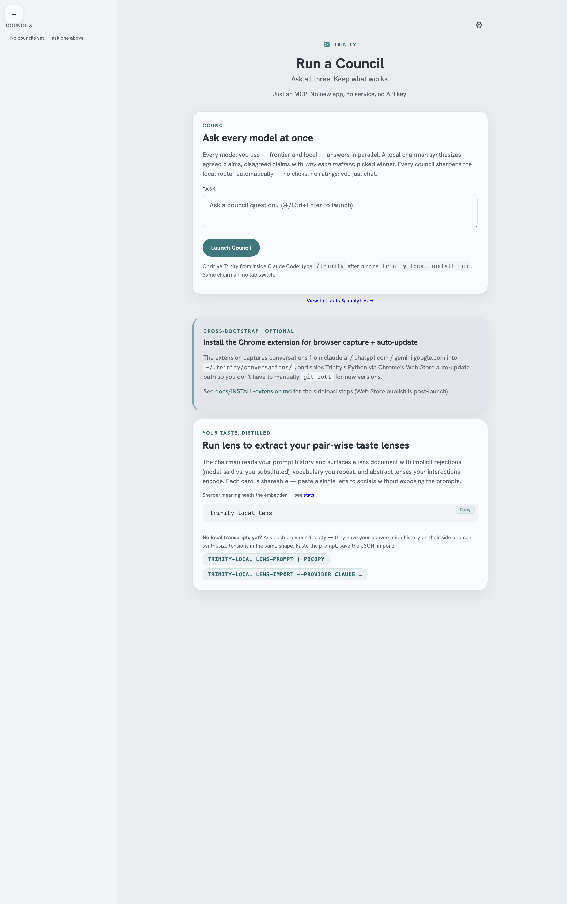

# ⠕ Trinity Local

[](https://github.com/keepwhatworks/trinity/actions/workflows/test.yml)
[](LICENSE)
[](pyproject.toml)
[](SECURITY.md)
[](https://github.com/keepwhatworks/trinity/stargazers)
[](https://keepwhatworks.com)

## Ask all three. Keep what works.

Send one prompt to Claude, ChatGPT, and Gemini at once. A chairman shows you what they agreed on and, more to the point, exactly **where they split** — the cross-provider read no single model can give you, however good it gets, because none of them can see the others. It works the moment you install. Then, from your own history, it learns **which side of those splits your work keeps taking**: which model to trust on your kind of question. Free, local, on the subscriptions you already pay for. No API key. Your transcripts never leave your machine.

**Install** is just an MCP and a Chrome extension. No new app, no cloud, no API key.



Inside Claude Code (or Codex CLI / Antigravity / Cursor), just ask:

> Run a Trinity council on whether to use SQLite or DuckDB for this analytics workload.

The agent calls `mcp__trinity-local__run_council` for you. Claude, Codex, and Gemini answer in parallel. The chairman synthesizes and returns the verdict inline:

> **Winner: DuckDB.** All three agree it wins on analytical scan speed.
> **Where they split:** Claude flags SQLite's simpler ops story. Codex and Gemini don't. *Why it matters for you:* you've shipped solo before and kept picking the lower-ops option. So the chairman weights that split toward "SQLite if you'll operate it alone."

The cross-provider council (three labs in parallel, one synthesized verdict with the splits called out) is the part no single chat tab can do, and it works the moment you install. Over your first handful of councils, the chairman starts reading your **lens**: the pattern in how you rephrase, judge, and decide, distilled from your own transcripts. So it learns which split matters to **you**. The launchpad above is the same surface in a browser tab. Open it from the Chrome extension to scan recent councils, your lens, and the topic graph.

**The Chrome extension does two things.** As you chat on claude.ai / chatgpt.com / gemini.google.com, it captures each conversation to `~/.trinity/conversations/` on your machine. No listening port, no upload. Chrome's Native Messaging spawns a local capture host on demand. And it hosts the launchpad you click open from the toolbar. Together with the CLI sessions on disk (`~/.claude/`, `~/.codex/`, `~/.gemini/`), the extension's captures are what your lens distills from.

**You'll want at least Claude + Codex CLI installed.** The magic is the *disagreement*. A council needs a second voice. One provider runs, but the "where they split" payoff needs two.

**Then it gets sharper: the lens.** The council gives you a synthesized answer now. The lens sharpens the next one. Every council, every rejected answer, every rephrase sharpens a profile of your judgment that lives only on your machine (Anthropic can't read your ChatGPT, and OpenAI can't read your Claude). The longer you use it, the better it knows which model to trust on *your* kind of question, measured on the disagreements your own later work settles. Ask it directly: `trinity-local trust` reads which model you side with when the labs split, per topic; `trinity-local trust "<topic>"` surfaces the recurring cross-provider disagreements you keep returning to.

> **First-run note: councils work immediately. The personalized read layers in.** Every council is full-fidelity from minute one (the cross-provider answer, the agreed claims, the splits), with nothing to download first. Only the *"weighted toward what **you'd** pick"* taste read sharpens with an optional one-time embedder: run `trinity-local download-embedder` (~600 MB, local, one time). Without it the lens falls back to a coarser lexical match and the personalized read is muted, but the council itself is unaffected. The lens then builds in the background from your transcripts. The *which-model-to-trust* read sharpens over your first handful of councils, not on minute one.

**No new app. No service. No API key.** Captures flow *to* your machine. Trinity uploads nothing. Your transcripts and lens stay on disk. Everything else is an MCP server inside the harnesses you already use. **Free for individuals, forever.** MIT, local. Running it across a team? Same product, with support: [Trinity for teams](docs/enterprise.md).

## Install

**Recommended**: one line. Clones the repo (you can read it end-to-end), installs the runtime deps, registers Trinity's MCP server in every harness it detects (Claude Code, Codex CLI, Antigravity, Cursor), and pre-wires the Chrome-capture host:

```bash
<!-- canonical:install_command -->curl -fsSL https://raw.githubusercontent.com/keepwhatworks/trinity/main/scripts/install.sh | bash<!-- /canonical -->
```

No PyPI, no npm, no API key. Just `git clone` + a couple of shell wrappers in `~/.local/bin/`. Verify with `trinity-local status`. To remove: `trinity-local uninstall --yes`.

**In Claude Code? One-command plugin install.** Trinity ships as a Claude Code plugin that registers the MCP server *and* adds native slash commands (`/trinity-local:council`, `:ask`, `:lens`). No manual `install-mcp`:

```
/plugin marketplace add keepwhatworks/trinity
/plugin install trinity-local@trinity
```

You still install Trinity itself once with the curl line above (there's no PyPI package). The plugin's launcher finds it. No Stop-hooks / review-gate: the plugin only adds commands + the MCP server, so it never gates your responses or runs away with your quota. Details: [`plugins/trinity-local/README.md`](plugins/trinity-local/README.md).

**Not comfortable in a terminal?** Paste that one line into **Claude Code** (it runs inside your terminal *and* in the **Claude Desktop** app) and let Claude run the install for you. That's the easiest path if you arrived via the Chrome extension and have never opened a shell.

**Manual MCP config.** If the bootstrap missed a harness, or you want to wire one by hand, that's exactly what `trinity-local install-mcp` writes. Substitute `PYTHON` with your interpreter (`which python3`, or the absolute path the bootstrap printed).

For **Claude Code** (`~/.claude.json`), **Cursor** (`~/.cursor/mcp.json`), **Antigravity** (`~/.gemini/settings.json`), and other JSON harnesses, merge into the top-level `mcpServers` object:

```json
{
  "mcpServers": {
    "trinity-local": {
      "command": "PYTHON",
      "args": ["-m", "trinity_local.main", "--mcp"]
    }
  }
}
```

For **Codex CLI**, append to `~/.codex/config.toml`:

```toml
[mcp_servers.trinity-local]
command = "PYTHON"
args = ["-m", "trinity_local.main", "--mcp"]
```

For **Antigravity** (`agy` CLI), model selection happens inside agy itself, not via MCP. Run `/model` and pick your Gemini (e.g. `Gemini 3.1 Pro`). Trinity's launchpad reads the persisted selection from `~/.gemini/antigravity-cli/settings.json`.

Then ask any of these agents: *"Run a Trinity council on …"* and the MCP tools appear inline. Free, local, MIT. The CLI (`trinity-local status`, `trinity-local lens`, etc.) is the engine. The MCP tools are the agent surface.

Requirements: Python 3.10+ and at least one of the `claude` / `codex` / `agy` CLIs authenticated. Trinity works with just one (chairman synthesis + your lens), gets stronger with two (real disagreement), full canonical council with three. **Ollama / MLX models you've pulled locally are auto-discovered** and join the routing pool as free council members (`ollama:<model>` / `mlx:<model>`). No config edit, no extra MCP tools. To remove: `trinity-local uninstall --yes`.

## How it works

Here is the whole system, and it runs on your machine.

1. **It reads your transcripts, across all three labs.** Your CLI sessions on disk (Claude Code, Codex CLI, Antigravity), the web chats the Chrome extension captures locally (claude.ai, chatgpt.com, gemini.google.com), and any exports you import. Nothing uploads.
2. **It distills them into your lens.** The pattern in how you rephrase, push back, and decide, turned into a hierarchy of paired tensions and subject basins. It learns from your transcripts, never from how the councils turn out. So the lens stays a record of your judgment, not a mirror of the tool.
3. **You run a council.** One prompt goes to Claude, ChatGPT, and Gemini in parallel. A chairman reads your lens and returns one verdict: what they agreed on, where they split, and which split matters to you. This works the moment you install.
4. **Each verdict is scored into its topic.** The chairman's pick drops into the nearest subject basin, building a per-topic record of which model wins your kind of question.
5. **The next question routes on that record.** A new prompt lands in its basin and goes to the model that has been winning there. Basins that are still a coin-flip get explored rather than forced. Thin ones fall back to a broader match until they earn a winner.

The council pays off from minute one. The lens and the routing sharpen with use. The same lens also scores any new model against your past corrections (`eval-run`) and ranks options on demand (the `choose` tool), each with its own accuracy receipt attached.

> **Anthropic can't recommend ChatGPT. OpenAI can't recommend Claude. Google can't recommend either. The competitive constraint is structural, not technical.** The labs that built the models you trust are commercially blocked from helping you use a competitor. So the cross-provider memory layer has to come from outside the labs. That's what Trinity is.

### And when a new model lands, score it against your taste

```bash
trinity-local eval-build      # one-time: build from your rejection signal (~/.trinity/me/preference_acts.jsonl)
trinity-local eval-run --target claude    # re-target whenever a new model lands (provider name: claude / codex / antigravity)
trinity-local eval-show       # per-axis bars: REFRAME / COMPRESSION / REDIRECT / SHARPENING
```

`eval-run` scores a model on the prompts you've already rejected, and the score defends itself before it prints: it **refuses the headline** if its own judge can't tell your rewrite from the answer you rejected. A judge that clears its validity floor produces a ranking. Below the floor the number reads "directional, not decisive," and the verdict falls to the judge-free layer no ranking can fake: the **disagreement ledger**, which counts how often you sided with each model on the disagreements your own later work settled. Either read is one no single lab can produce, because only the layer above them sees your transcripts across all three.

---

### Your lens, generated from your prompts.

`trinity-local lens --deep` is the consolidation pass. Like sleep: it
**reweights old facts in light of everything that's come in since**,
**resolves memories that contradicted each other**, and connects
**memories that were just sitting there with their neighbors**. It turns
a corpus of raw prompts into a hierarchical lens (identity → paired
tensions → subject basins → vocabulary) that the chairman reads top-down
on every council.

**Traceability is non-negotiable.** *If it can't show its work, it
doesn't get to claim the thought.* Every lens entry carries
`tension_decisions`: backreferences to the specific rejection pairs
that justify it. Open the launchpad's lens card and each claim links
back, clickable, to the model-said-vs-you-substituted moments it was
extracted from. No hidden inference, no "trust me." Inspect any claim.
Walk the chain to the source.

**The folder is the API.** `~/.trinity/` is a CC0 JSON-Schema-validated
on-disk contract: `memories/lens.md`, `memories/topics.json`,
`memories/vocabulary.md`, `core.md`, `scoreboard/picks.json`. Any tool
(Aider / Cline / Continue / your own) can read or write through that
folder without going through Trinity's process, so your taste capture
outlives Trinity itself. Schema in
[`docs/lens.md`](docs/lens.md) + [`docs/PREFERENCE_CORPUS_SPEC.md`](docs/PREFERENCE_CORPUS_SPEC.md).

## Privacy by default

- **Trinity uploads nothing.** Your transcripts, prompt history, and lens stay on
  disk. (Councils dispatch your question to the labs through the CLIs *you* already
  authenticated, the same path as typing it there yourself, never to a Trinity server.)
- **Anonymous categorical telemetry is on by default** (Google Analytics 4). Two
  payloads, both categorical/numeric only: the per-council event
  (`task_type`, `winner`, `member_count`, `mode`) and, from the launchpad, an anonymous
  provider win-rate snapshot (per-provider Elo / wins / total games, no task text). No
  prompt content, no lens text, no user_substitute strings ever. Disable any time with
  `trinity-local telemetry-disable`. The data immediately stops flowing. Sending also
  requires GA4 credentials that the public build does **not** ship. Without
  `TRINITY_GA4_MEASUREMENT_ID` + `TRINITY_GA4_API_SECRET` set, both the CLI and the
  launchpad silently no-op (nothing leaves your machine).
- **No hosted controller, no per-call billing.** Trinity dispatches via the CLIs you already
  use. Nothing to meter, nothing to bill. The taste signal you build stays yours.

## Objections (the ones I had)

**"I don't want to learn another UI. I just use Claude Code."**
You don't. Trinity is an MCP server inside your existing harness (Claude Code, Codex CLI, Antigravity, Cursor). `/trinity` walks installation in one step. After that, your existing UI is the UI.

**"I don't want a daemon running on my machine."**
Trinity isn't a daemon. The MCP server spawns when your harness opens, exits when it closes. ~62 MB resident while connected. `lsof -i | grep LISTEN` shows nothing. No listening port, no background process.

**"I don't want my data sent to a server."**
Transcripts never leave your machine. Council fan-out goes from your laptop directly to the CLIs you already authenticated. No hosted controller. Anonymous categorical telemetry (the four discrete labels above, no prompt content) is on by default to close the feedback loop. Turn it off any time with `trinity-local telemetry-disable`.

**"I want my subscriptions actually used."**
Trinity dispatches via your existing `claude` / `codex` / `agy` CLIs, using the tokens you've already paid for. Every council uses what you have. No new bill.

**"I'm tired of copy-pasting between Claude / GPT / Gemini tabs."**
That's the whole point. Every council runs all three in parallel from one prompt.

**"I want to know if a new model release is actually better for me."**
`trinity-local eval-run --target <provider>` scores it against the prompts you've already rejected: your actual taste, not a synthetic benchmark. The target (claude / codex / antigravity) is the provider you want to benchmark. The underlying model is whatever that provider currently ships. The score defends itself before it prints: every run probes its own judge and eval set with control candidates (can the judge tell your correction from the answer you rejected? does the model actually beat "echo the question back"?) and **refuses the headline** if a dumb baseline matches it. A refused number never ranks on the leaderboard or ships on a share card.

**"I want the right model picked for the right task, automatically."**
That's steps 4 and 5 above. Every council's chairman-pick is tallied into its topic basin (`scoreboard/picks.json`), and the next question routes on whoever has been winning that basin. No human rating step, no config edit. The launchpad surfaces the table so you can see it forming.

**"How is this different from Anthropic's Dreaming?"**
Same verb, different domain. Dreaming consolidates Claude sessions inside Anthropic's runtime. Single-lab. Trinity dreams *across the labs*: `~/.claude/` + `~/.codex/` + `~/.gemini/` + claude.ai + ChatGPT + Gemini exports, on your machine. Even if Anthropic moves Dreaming server-side tomorrow, the server-side version still can't see OpenAI or Google transcripts. The labs are commercially prevented from reading each other. Cross-lab dreaming has to come from outside the labs, by definition. Dreaming makes Claude smarter at being Claude. Trinity learns which model wins which kind of YOUR question.

**"Won't Anthropic just build cross-provider memory themselves?"**
They literally can't. Anthropic can't recommend ChatGPT. OpenAI can't recommend Claude. Google can't recommend either. The competitive constraint is structural, not technical. The cross-provider layer has to come from outside the labs. That's the whole point.

**"Who's behind this? Why trust a random repo with my transcripts?"**
Single developer, MIT, public source. Small enough to audit in an evening. Trinity reads transcripts on your machine, written there either by your CLI sessions or by the Chrome extension's local capture host. Nothing leaves the machine. If you stop using it, `~/.trinity/` is plain JSON you can `cat | jq` without us.

**"What happens if you abandon this project?"**
The folder is the API. `~/.trinity/memories/lens.md` is Markdown. Council outcomes are human-readable JSON. The schema is at [`docs/PREFERENCE_CORPUS_SPEC.md`](docs/PREFERENCE_CORPUS_SPEC.md). Your taste capture survives Trinity disappearing.

## How is this different from \[X\]

| | Trinity Local | LMArena | promptfoo / Claude evals | OpenRouter | Karpathy LLM Council |
|---|---|---|---|---|---|
| Data source | **Your own prompts** | Crowd votes | Test fixtures | n/a (router) | Yours, but no persistence |
| Cost basis | Your own subscriptions | Hosted | Per-call API | Per-call API | Per-call API |
| Output | **Structured Routing JSON + your `lens`** | Win-rate ranking | Pass/fail per case | Cheapest route | Three answers + summary |
| Privacy | **Corpus stays on disk** | n/a | n/a | Prompts route through their servers | Hosted |
| Personalization | **Personal routing table improves with use** | One global ranking | Per-test-suite | None | None |
| Personal benchmarks | **`eval-run` scores any model against YOUR actual rejections** | Synthetic prompts | Static fixtures | n/a | n/a |
| Council reads through your lens | **Your lens (mined from your transcripts) breaks the chairman's quality-ties + powers personal evals** | n/a | n/a | n/a | Generic synthesis |
| Shareable artifact | **`lens` PNG card** | Leaderboard link | Eval report | n/a | Per-prompt summary |

If you want "which model is best in general," LMArena. If you want "which model handles **this
codebase / this voice / this trade-off you keep making**," Trinity.

## Demo

A real council outcome, verbatim from `~/.trinity/council_outcomes/<id>.json` after the council ran *"name the single biggest remaining launch risk"* against itself:

```json
{
  "winner": "claude",
  "runner_up": "codex",
  "confidence": "high",
  "agreed_claims": [
    "The #1 risk is the /trinity skill not installing by the pip path.",
    "install-mcp must drop SKILL.md into ~/.claude/skills/trinity/ before ship."
  ],
  "disagreed_claims": [{
    "claim": "Post-validator must check for skill cache-staleness.",
    "providers_for": ["claude"],
    "providers_against": ["antigravity", "codex"],
    "why_matters": "install-mcp can succeed on disk but /trinity stays invisible to the open Claude Code session."
  }],
  "routing_lesson": "For launch_readiness_decision, prefer claude — surfaces second-order failure modes."
}
```

That's the payoff: agreed claims you can lean on, disagreed claims with the *why*, and a routing lesson that makes the next council pick the right chairman automatically. Trinity ran this against itself to ratify what would ship.

## Architecture

Chairman synthesizes member outputs into structured Routing JSON. Members run in
parallel. Lens-discovery is a 5-stage
pipeline (Stage 0 turn-pair rejections + Stages 1-4 basins→decisions→pair-mining→post-filter) ratifying tensions across ≥3 topical basins.

**Want the full picture?** [`docs/how-trinity-works.md`](docs/how-trinity-works.md) walks the pipeline end-to-end: transcripts → embeddings → lens → runtime. Wire diagram + design rationale in [`docs/architecture.md`](docs/architecture.md).

## What's next

Current repo state: v1.7 line, exact package `v<!-- canonical:version -->1.7.397<!-- /canonical -->`. The shipped surface is MCP-first: `lens`, `council`, `status`, and `install` are the advertised CLI verbs. The older `lens-build` / `council-launch` / `dream` names remain as compatibility aliases (`dream` folded into `lens --deep` 2026-07-04, one concept) for launchpad dispatch and existing scripts. The most recent arc collapsed routing into the lens. `consolidate` now places each council into its nearest lens basin and tallies the chairman-winner there, so the learned routing can never drift into a stale embedding space. Earlier work tightened the launch path: extension auto-wiring, schema migrations, real ModernBERT embeddings, TF-IDF abstain-gates for semantic flows, corpus-purity guards, personal eval integrity, no-PII telemetry gates, and install-wrapper Python fallback.

## Help

| Command | What it does |
|---|---|
| `trinity-local status` | Health + scoreboard + recent councils (absorbed `doctor`) |
| `trinity-local council --task "..."` | Run a council from the terminal |
| `trinity-local trust "<topic>"` | The recurring cross-provider disagreements you keep returning to on a topic |
| `trinity-local trust` | Which model you side with when the labs split, from your own resolved disagreements |
| `trinity-local lens` | Build your lens from prompt history |
| `trinity-local lens --deep` | Mine your history + rebuild the whole memory layer |
| `trinity-local install` | Install or repair MCP / extension wiring |
| `trinity-local me-card` | Render your strongest lens as a PNG |
| `trinity-local portal-html --open-browser` | Open the launchpad |
| `trinity-local review-link <council_id> --json` | Mobile-safe review links |
| `trinity-local --help` | Full command list |

## License

MIT. See [`LICENSE`](LICENSE).
